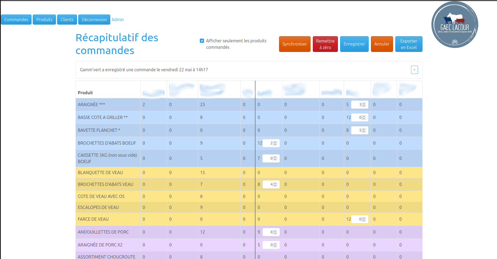
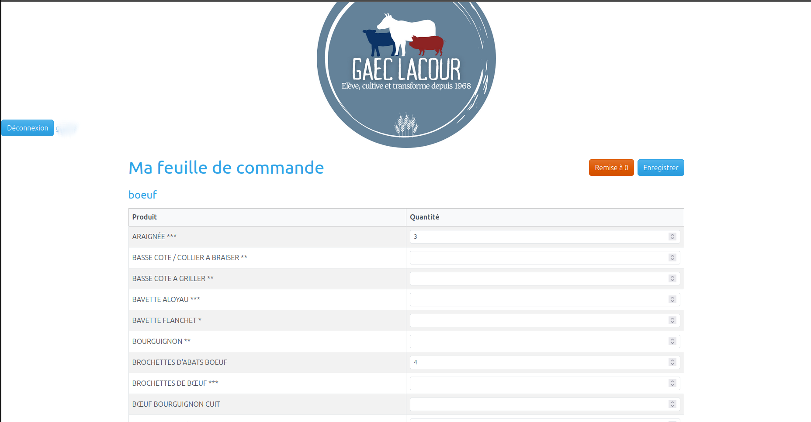

# 🥩 Application de gestion de commandes

Application web métier développée en autonomie complète dans le cadre d'un projet de reconversion vers le développement logiciel.

L'objectif : remplacer un processus manuel (téléphone, papier, tableur) par une application web sécurisée permettant à un exploitant agricole-charcutier et à ses clients de gérer leurs commandes hebdomadaires.

---

## 🎯 Contexte et motivation

En reconversion vers le développement à 42 ans, j'ai profité de la demande d'aide d'une amie pour construire un **projet concret, utile et déployable**.

Il m'a permis de pratiquer l'ensemble de la stack backend/frontend dans un contexte professionnel : recueil et analyse des besoins clients, modélisation des données, sécurité applicative, logique métier, et expérience utilisateur, puis déploiement.

---

## ✨ Fonctionnalités

### Espace client
- Authentification sécurisée par login/mot de passe
- Saisie de sa feuille de commande hebdomadaire par catégorie de produit (bœuf, veau, porc)
- Détection des modifications non enregistrées (alerte avant de quitter la page)
- Remise à zéro des quantités

### Espace administrateur
- **Tableau de commandes** : vue consolidée de toutes les commandes clientsgit 
- Synchronisation manuelle des commandes vers la vue admin
- Remise à zéro globale
- **Export Excel** (.xlsx) du récapitulatif des commandes
- **Gestion des produits** : création, modification, suppression, activation/désactivation
  - Un produit commandé ne peut pas être désactivé (protection via API)
- **Gestion des clients** : création, modification, suppression, assignation des produits accessibles et du mode de saisie

---

## 🛠️ Stack technique

| Couche | Technologie |
|---|---|
| Langage | Java 21 |
| Framework backend | Spring Boot 3.5 |
| Persistance | Spring Data JPA / Hibernate |
| Base de données | PostgreSQL |
| Sécurité | Spring Security (authentification par formulaire, rôles ADMIN/CLIENT) |
| Templates | Thymeleaf + Thymeleaf Security Extras |
| CSS / UI | Bootstrap 5 (thème Cerulean / Bootswatch) |
| Build | Maven |

---

## 🏗️ Architecture

Le projet suit une architecture MVC classique avec une séparation claire des responsabilités :

```
src/main/java/
├── controller/          # Contrôleurs Spring MVC (admin + client)
├── model/               # Entités JPA (User, Product, OrderItem, AdminOrderItem, Order)
├── repository/          # Interfaces Spring Data JPA
├── service/             # Logique métier
├── dto/                 # Objets de transfert de données (formulaires)
└── security/            # Configuration Spring Security, UserDetailsService
```

**Points d'architecture notables :**
- Séparation entre `OrderItem` (commandes brutes des clients) et `AdminOrderItem` (vue admin avec suivi du réalisé) — deux tables distinctes avec synchronisation contrôlée
- Clé composite (`OrderItemId`) pour les lignes de commande (userId + productId)
- Relation `@ManyToMany` entre `User` et `Product` pour les produits accessibles par client
- Protection CSRF active sur tous les formulaires POST
- API REST partielle (`PATCH /admin/produits/{id}/active`) pour les interactions JavaScript

---

## 📸 Aperçu des écrans

### Vue admin — Récapitulatif des commandes
Tableau croisé clients × produits, avec distinction visuelle par catégorie (couleurs), séparation entre clients en mode Stock et mode Commande, et saisie inline du réalisé.



### Vue client — Feuille de commande
Interface épurée, centrée sur la saisie rapide par catégorie de produit, avec confirmation avant tout départ de page non enregistré.




---

## 📚 Ce que ce projet m'a appris

Ce projet a été l'occasion de travailler sur des problématiques concrètes que l'on rencontre en entreprise :

- **Communication** : recueil et reformulation des besoins métier auprès d’un client non technique, avec adaptation des solutions proposées
- **Modélisation de données** : penser les entités, les relations et les contraintes d'intégrité avant de coder
- **Sécurité web** : gestion des rôles, protection CSRF, encodage des mots de passe avec BCrypt
- **Expérience utilisateur** : prévenir la perte de données, donner du feedback visuel, gérer les cas limites (produit commandé qu'on ne peut pas supprimer)
- **Séparation des responsabilités** : ne pas mélanger la logique métier, l'accès aux données et la présentation
- **Performances** : optimisation des requêtes base de données pour réduire la charge serveur
- **Itération** : partir d'un besoin réel, le raffiner au fil des retours

---


## Ce que j'aurais pu améliorer

Ce projet m’a permis de comprendre la mise en œuvre des requêtes AJAX. Avec davantage de recul, certains choix d’architecture auraient pu être optimisés.

L’apprentissage des bases de données SQL étant encore en progression, la modélisation et certaines requêtes auraient pu être améliorées.


---

## ☁️ Déploiement — Application en production

L'application est **déployée et utilisée en production** sur [Railway](https://railway.app) :

🔗 **[https://serveur-commandes-production.up.railway.app](https://serveur-commandes-production.up.railway.app)**

### Infrastructure Railway
- **Service applicatif** : le JAR Spring Boot est buildé et exécuté directement par Railway via le `pom.xml` (pas de Dockerfile nécessaire)
- **Base de données** : instance PostgreSQL hébergée sur Railway, reliée à l'application via les variables d'environnement injectées automatiquement

### Pourquoi pas de démo publique ?

L'application est utilisée en production, les données de commande sont confidentielles — aucun compte de démonstration n'est donc disponible publiquement.


## 🚀 Lancer le projet en local

### Prérequis
- Java 21
- Maven
- PostgreSQL

### Configuration
Créer une base de données PostgreSQL et mettre à jour `src/main/resources/application.properties` :

```properties
spring.datasource.url=jdbc:postgresql://localhost:5432/charcuterie
spring.datasource.username=votre_user
spring.datasource.password=votre_mot_de_passe
```

### Démarrage
```bash
./mvnw spring-boot:run
```

L'application est accessible sur `http://localhost:8080`.


---

## 👤 À propos

Reconversion professionnelle vers le développement web/Java à 42 ans. Ce projet illustre ma capacité à concevoir et livrer une application complète de façon autonome, en m'appuyant sur les technologies utilisées dans le monde professionnel.

Je recherche une **formation en alternance** ou un **contrat d'apprentissage** pour structurer et approfondir mes compétences aux côtés de professionnels du secteur.

---

*Projet réalisé en autodidacte — open to feedback !*
